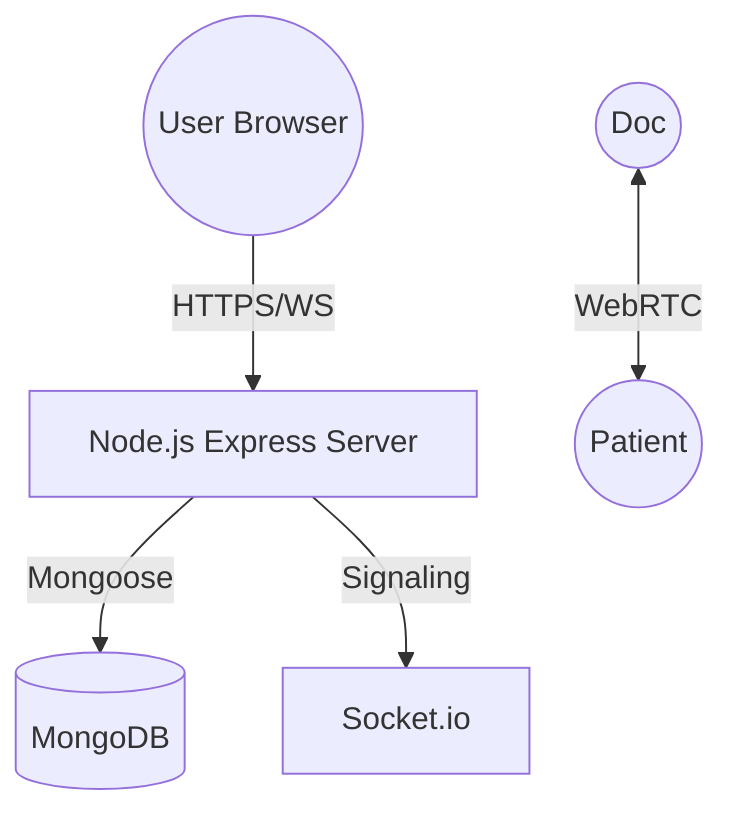

# PsyConnect - Technical Specifications V2.1 (Profile & Documents Update)

Welcome to the official technical documentation for the PsyConnect platform. This guide provides an in-depth look into the system's architecture, data models, and real-time logic.

---

## 🏗️ System Architecture

PsyConnect utilizes a modern, real-time stack designed for healthcare reliability.



### Core Technologies
* **Backend**: Node.js & Express.js
* **Persistence**: MongoDB (Mongoose ODM)
* **Real-time**: Socket.io v4.0+
* **Consultations**: WebRTC (Peer-to-Peer Video & Screen Sharing)
* **Design**: Vanilla CSS3 (Glassmorphism & Flexbox/Grid)

### Key Libraries & APIs
* **Backend**: `bcryptjs` (Hashing), `jsonwebtoken` (Auth), `mongoose` (ODM).
* **Communication**: `socket.io` (Real-time), `WebRTC` (P2P).
* **Frontend Tools**: `html2pdf.js` (Export), `ui-avatars.com` (Assets).

---

## 🗄️ Database Schemas (Detailed)

### 👤 User Model
| Field | Type | Attributes | Description |
| :--- | :--- | :--- | :--- |
| `firstName` | String | Required, Trim | User's first name. |
| `lastName` | String | Required, Trim | User's last name. |
| `email` | String | Unique, Lowercase | Primary identifier & login email. |
| `password` | String | Select: false | Bcrypt hashed (10 rounds). |
| `role` | String | Enum | `patient`, `doctor`, or `admin`. |
| `isSuperAdmin`| Boolean| Default: false | Full platform management access. |
| `profilePicture`| String | Default: '' | URL or base64 of the user avatar. |
| `bio` | String | Default: '' | Professional biography. |
| `specialty` | String | Default: '' | Medical/Psychological specialty. |
| `certification`| String | Optional | Base64 encoded diploma/certificate. |
| `cv` | String | Optional | Base64 encoded curriculum vitae. |
| `availability` | String | Optional | Text description of working hours. |
| `consultationMode`| String| Enum | `online`, `presence`, or `both`. |

### 📜 Prescription Model
| Field | Type | Description |
| :--- | :--- | :--- |
| `doctor` | ObjectId | Reference to the issuing User. |
| `patient` | ObjectId | Reference to the recipient User. |
| `medicines` | Array | Objects containing: name, dosage, duration, notes. |
| `instructions`| String | General medical advice for the patient. |

---

## 🛡️ API Reference & Middleware

### Authentication
* `POST /api/auth/register`: Public registration (Force role: patient).
* `POST /api/auth/login`: Identity verification. Returns 8h JWT.

### Patient & Public API
* `GET /api/patient/doctors`: Public endpoint to fetch all specialists with their full profiles and documents.

### Role-Based Access Control
> [!IMPORTANT]
> All private routes are protected by tiered middleware:
> 1. `auth`: Verifies JWT validity.
> 2. `isAdmin`: Verifies user has administrative privileges.
> 3. `isSuperAdmin`: Verifies platform owner privileges.

---

## 📹 Real-time Engine (WebSocket & WebRTC)

### Signaling Flow
1. **Join**: Both users join a room via `join-room`.
2. **Alert**: Doctor emits `start-call`. Patient receives pulse animation and ringtone.
3. **Connect**: WebRTC offer/answer exchange via Socket.io.
4. **Share**: Doctor can initiate `getDisplayMedia` to share their screen instantly.

### Screen Sharing Logic
The `toggleScreenShare` function in `webrtc.js` uses high-performance track replacement:
```javascript
// Example Logic
sender.replaceTrack(screenTrack);
```
This ensures the video stream is swapped without dropping the connection.

---

## 🌍 Multi-language Implementation

The `i18n.js` engine provides on-the-fly translation without page reloads.

* **Detection**: Reads `localStorage.getItem('lang')`.
* **RTL Support**: Flips document direction for Arabic (`ar`).
* **Attributes**: Uses `data-i18n` for structural elements and dynamic text.

---

## 🎨 Premium UI Features

### Public Doctor Profiles
* **Dynamic Modals**: Clicking a specialist card on the landing page opens a high-detail modal.
* **Document Viewer**: Professional documents (Certifications, CV) are viewable instantly via a secure `iframe` implementation.
* **Consolidated Logic**: The landing page uses a unified initialization script for auth state, mobile menus, and specialist loading.

---

## 🎨 Design System & UI/UX

### Typography
* **Primary (Inter)**: Clean, high-legibility sans-serif for UI elements.
* **Branding (Playfair Display)**: Classic serif for logos and headings.
* **Arabic (Cairo)**: Modern sans-serif optimized for RTL readability.

### Color Palette
| Token | Hex | Role |
| :--- | :--- | :--- |
| `--primary` | `#6366f1` | Brand Indigo. |
| `--primary-dark`| `#4f46e5` | Hover/Pressed states. |
| `--secondary` | `#8b5cf6` | Accents & Secondary brand. |
| `--accent` | `#ec4899` | CTA & Emphasis. |
| `--text-dark` | `#1e293b` | Primary text. |
| `--bg-light` | `#f8fafc` | Main platform background. |

### Core Logic (Functions)
| Component | Function | Responsibility |
| :--- | :--- | :--- |
| `index.html` | `fetchDoctors` | Asynchronous Specialist rendering. |
| `index.html` | `openDoctorProfile`| Modal data orchestration. |
| `webrtc.js` | `toggleScreenShare`| Real-time track replacement logic. |
| `i18n.js` | `applyLanguage` | Comprehensive RTL & Translation sync. |

---

## 📊 Security & Compliance

* **Data Privacy**: All video data is routed Peer-to-Peer via WebRTC.
* **Encryption**: Industry-standard password hashing using Bcrypt.
* **Session Management**: JWT tokens for stateless, secure API communication.

---

*© 2026 PsyConnect - Developed with excellence.*
